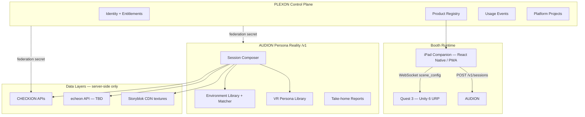

# Persona Reality — Implementation Roadmap (Stand: Juni 2026)

**Ziel:** Booth-ready VR-Erlebnis (Quest 3) + AUDION Session-Composer + iPad Companion — **open source**, **contract-first**, **PLEXON-föderiert**.

**Leitplanken aus TIK-Specs:** Offline-resilient am Stand, `scene_config.json` als API-Vertrag, Matrix statt Katalog, keine Live-API-Calls von der Quest.

---

## 1. Architektur-Überblick



### Repo-Strategie (TIK Monorepo + MSQ Deploy-Repos)

| Pfad / Repo | Lizenz | Inhalt |
|-------------|--------|--------|
| **TIK** (Monorepo) | Apache-2.0 + MIT (`unity/`) | Specs, `backend/`, `unity/`, fixtures, `knowledge/` |
| **AUDION-v2** (Deploy) | Apache-2.0 | Spiegelt `TIK/backend/` für Coolify-Produktion |
| **companion/** (später in TIK oder eigen) | MIT | iPad PWA, WebSocket bridge |
| **CHECKION / PLEXON** | — | Föderierte Produkte, keine VR-Runtime |

**TIK = eine Git-URL für OSS.** AUDION/CHECKION/PLEXON bleiben separate Deploy-Einheiten; Sync-Doku: `knowledge/audion-sync.md`.

---

## 2. Tech-Stack (State of the Art, Juni 2026)

### Unity Client (Quest 3)

| Komponente | Version / Wahl | Begründung |
|------------|----------------|------------|
| Engine | **Unity 6 LTS** (6000.0.x) | LTS-Stabilität, URP-first |
| Render | **URP** Single-Pass Stereo | Quest-Standard |
| XR | **OpenXR** + **Unity Meta OpenXR** | Meta empfiehlt OpenXR statt Legacy Oculus Plugin ([Unity Meta Quest workflow](https://docs.unity3d.com/6000.0/Documentation/Manual/xr-meta-quest-develop.html)) |
| Interaction | **XR Interaction Toolkit 3.x** | ~35% weniger Interactor-Overhead vs 2.x; Ziel-Latenz 55–75ms |
| Avatare | **Ready Player Me** WebView/GLB loader | Spec-konform |
| JSON | **Newtonsoft.Json** (Unity NuGet) | snake_case, Enums |
| Assets | **Addressables** local-bundled | Booth-offline |
| Narrative | **Unity Timeline** pro Act | Spec: kein Act-FSM |
| CI | **GameCI** + custom Performance Validator | Build + Budget-Gates |

### AUDION Backend (/v1)

| Komponente | Version / Wahl |
|------------|----------------|
| Runtime | Python 3.12, **FastAPI** |
| Models | **Pydantic v2** aus OpenAPI (`datamodel-code-generator`) |
| Validation | `jsonschema` gegen `scene_config.v1.schema.json` |
| DB | PostgreSQL (neues Schema `persona_reality`) |
| Cache | Redis (echeon 30min, sessions 24h) |
| Deploy | Coolify + Traefik (wie AUDION-v2) |
| Tests | pytest + golden snapshot tests |

### iPad Companion

| Komponente | Wahl |
|------------|------|
| UI | **Next.js 16** PWA oder Expo RN — PWA bevorzugt (schneller, `@msqdx/react`) |
| Transport | WebSocket (`ws://` booth LAN) + REST fallback |
| Auth | PLEXON session / booth operator API token |

### echeon

**Status:** Kein Code in MSQ-Repos gefunden. Phase 1: **Mock-Adapter** + Interface in OpenAPI; Phase 2: echte API wenn verfügbar.

---

## 3. PLEXON-Integration (konkret)

### 3.1 Product Registry

Neuer Eintrag in `PLEXON/lib/platform-products.ts`:

```typescript
{
  id: 'persona_reality',  // PlatformProductId erweitern
  name: 'Persona Reality',
  lifecycle: 'active',
  surface: 'federated',
  homeUrl: NEXT_PUBLIC_PERSONA_REALITY_URL,  // iPad admin / booth dashboard
  capabilities: ['vr_sessions', 'booth_companion'],
}
```

### 3.2 Federation Contract (bestehend nutzen)

| Mechanismus | Nutzung |
|-------------|---------|
| `X-Service-Secret` + `X-Plexon-Contract-Version` | AUDION → CHECKION für Snapshot-Aggregation |
| `POST /api/services/usage/events` | Pro `POST /v1/sessions`: Event `persona_reality.session_composed` |
| Platform Projects | `client_id` → `platform_project_id` → `checkion_project_id` (bestehendes AUDION-Feld) |
| Entitlements | Booth-Operator-Rolle: darf Sessions starten, keine Admin-Rechte |

### 3.3 Neue PLEXON-Surfaces (Phase 5+)

| Surface | Zweck |
|---------|-------|
| `/products/persona-reality` | Session-Log, letzte Compositions, Health |
| Board MCP Tool | `compose_persona_reality_session` — Debug für Messe-Setup |
| Admin: Client → CHECKION-Binding | Vaillant/Bosch `client_id` → Projekt-ID |

Details: `knowledge/plexon-integration.md`

---

## 4. Phasenplan

### Phase 0 — Foundation (Woche 1–2) ✅ teilweise

| Deliverable | Owner | Done when |
|-------------|-------|-----------|
| `scene_config.v1.schema.json` | TIK | Validiert golden JSON |
| `fixtures/golden/klaus_dortmund_de.json` | TIK | Unity + pytest grün |
| `LICENSE` (Apache-2.0) + `README.md` | TIK | OSS-klar |
| `knowledge/repos-and-urls.md` | TIK | Keine hardcoded URLs im Code |
| CI: Schema-Validate on PR | TIK | GitHub Action |

### Phase 1 — Contract & Shared Types (Woche 2–3)

| Deliverable | Repo |
|-------------|------|
| OpenAPI → Pydantic (`apps/persona-reality-api/schemas/`) | AUDION-v2 |
| OpenAPI → C# DTOs (generated or hand-maintained `Scripts/Data/`) | persona-reality-unity |
| `POST /v1/sessions` **stub** → golden config | AUDION-v2 |
| `GET /v1/personas` aus VR-Persona-Tabelle | AUDION-v2 |
| pytest: schema + snapshot | AUDION-v2 |
| Vitest/Editor: JSON schema check | persona-reality-unity |

**Exit:** Unity lädt Mock-Session ohne iPad; iPad könnte REST stub callen.

### Phase 2 — AUDION Composer MVP (Woche 4–6)

| Deliverable | Details |
|-------------|---------|
| DB migrations | `pr_environments`, `pr_vr_personas`, `pr_sessions`, `pr_client_bindings` |
| Environment matcher | Algorithmus aus `04-audion-backend.mdc`, unit-tested, deterministisch |
| CHECKION adapter | Parallel: `geo-summary`, `ranking-summary`, `domain-summary` → `CheckionSnapshot` |
| echeon adapter | Mock → später live |
| Narrative beats builder | Regelbasiert v1, LLM optional v2 |
| `POST /v1/sessions` production path | p95 < 1.5s, 503 mit cache fallback |
| Report stub | `GET /v1/reports/{id}` HTML minimal |

**Exit:** `curl POST /v1/sessions` liefert valides, persona-spezifisches JSON.

### Phase 3 — Unity Runtime Core (Woche 4–8, parallel)

| Deliverable | Details |
|-------------|---------|
| Projekt-Scaffold | Struktur aus `unity-project-skeleton.md` |
| `SceneConfigLoader` + DTOs | Newtonsoft, link.xml |
| `ActDirector` + 5 Timeline-Skelette | Act 1–5 placeholder envs |
| `BeatTriggerSystem` + TriggerBase | Events, kein coroutine coupling |
| Addressables groups | environments, voiceovers_de/en |
| `BoothCompanionListener` | WebSocket mock in Editor |
| `90_EnvironmentSandbox` | Artist iteration |
| Performance Validator (Editor) | Draw calls, tris, materials |

**Exit:** Play Mode mit `dev_klaus_dortmund.json` durch alle 5 Acts (greybox).

### Phase 4 — Content & Data Layers (Woche 8–12)

| Deliverable | Details |
|-------------|---------|
| 3 VR Personas seed | klaus_dortmund, +2 |
| 8–12 Environment shells | Matrix-Abdeckung Acts 1–5 |
| NOVA VO tracks (DE) | ElevenLabs batch → Addressables |
| `EcheonFeedRenderer` auf Phone | Act 2 |
| `CheckionDashboardRenderer` | Act 3 Monitor |
| `DiegeticMetricAnchor` + 2 presets | glow_warm, pulse_red |
| Ready Player Me flow | Act 1 mirror morph |
| Brand layer | Vaillant props_swap demo |

**Exit:** End-to-end greybox mit echten Datenlayern (nicht Platzhalter).

### Phase 5 — iPad Companion (Woche 10–12)

| Deliverable | Details |
|-------------|---------|
| Persona selector UI | `GET /v1/personas` |
| Session compose + WS push | LAN discovery optional (mDNS) |
| PLEXON login / booth token | Entitlement check |
| „Nächster Besucher“ Reset | Signal an Quest |
| Offline queue | Retry wenn AUDION kurz down |

**Exit:** Booth-Flow ohne Unity Editor.

### Phase 6 — PLEXON & Ops (Woche 12–14)

| Deliverable | Details |
|-------------|---------|
| Product registry + env vars | Coolify |
| Usage events | session_composed |
| Staging deploy | audion-staging + Quest dev build |
| Federation smoke tests | wie `federation-production-verification.md` |
| DSGVO-Dokumentation | Pitch-ready (Bosch, Vaillant) |

### Phase 7 — Booth Hardening (Woche 14–16)

| Deliverable | Details |
|-------------|---------|
| Device QA auf Quest 3 | 90 fps sustained, OVR Metrics |
| Pre-compose cron | echeon refresh 30min |
| Fallback configs | cached last-good session |
| Take-home QR + Report | Mobile HTML |
| Runbook | `knowledge/booth-operations.md` |

### Phase 8 — Open Source Release (Woche 16+)

| Deliverable | Details |
|-------------|---------|
| Public TIK repo | Specs + Schema (bereits GitHub) |
| Unity repo public | MIT, CONTRIBUTING, issue templates |
| AUDION /v1 docs | OpenAPI in README |
| „Build your own booth“ guide | Ohne MSQ-interne Secrets |

---

## 5. CHECKION → CheckionSnapshot Mapping

| UI-Label (DE) | CHECKION Endpoint | Feld |
|---------------|-------------------|------|
| GEO-Sichtbarkeit | `GET .../geo-summary` | `data.score` |
| Google-Ranking | `GET .../ranking-summary` | `data.score` |
| Website-Score | `GET .../domain-summary` | `data.score` |
| Seiten indexiert | `GET .../domain-summary` | `data.totalPageCount` |
| Share of Voice | `GET .../geo-latest-result` | competitive metrics |

Timeout: **800ms** pro Upstream, cached fallback (TIK-Regel).

---

## 6. Qualität & CI

| Gate | Wo |
|------|-----|
| JSON Schema validate | TIK CI, AUDION pre-response |
| Golden snapshot diff | AUDION pytest |
| OpenAPI breaking change | oasdiff in TIK PR |
| Unity Performance Validator | GameCI + manual vor Messe |
| Federation contract test | PLEXON vitest + cross-repo smoke |
| Latency p95 < 1.5s | k6 oder pytest-benchmark auf `/v1/sessions` |

---

## 7. Risiken & Mitigationen

| Risiko | Mitigation |
|--------|------------|
| echeon nicht implementiert | Mock + klare Interface; Act 2 mit Curated Feed |
| Persona-Modell AUDION ≠ VR axes | Separate `pr_vr_personas` Tabelle, optional Link zu UUID |
| Quest Performance | Früh greybox auf Device, Validator ab Woche 4 |
| Booth WiFi | Alles in config; WS nur vom iPad im LAN |
| Scope Creep (Codec Avatar, live TTS) | Explizit out of scope v1 (siehe `01-project-context.mdc`) |

---

## 8. Nächste konkrete Schritte (diese Woche)

1. **TIK:** `scene_config.v1.schema.json` + `fixtures/golden/klaus_dortmund_de.json` (erledigt in diesem PR)
2. **AUDION-v2:** Branch `feat/persona-reality-v1` — Router-Skeleton + pytest gegen golden
3. **persona-reality-unity:** Unity Hub Projekt anlegen, Package Manifest, `SceneConfigLoader` Stub
4. **PLEXON:** Issue/Ticket für `persona_reality` Registry-Eintrag (kein Code bis Phase 6)
5. **CHECKION:** Service-Token mit Zugriff auf Demo-Projekt für Snapshot-Adapter

---

## 9. Definition of Done — MVP Messe

- [ ] Besucher wählt Persona auf iPad (DE)
- [ ] AUDION composes in < 1.5s, validiert gegen Schema
- [ ] Quest spielt 5 Acts ohne Netzwerk (außer initial WS)
- [ ] Act 2 News, Act 3 CHECKION-Dashboard, Act 4 diegetische Metriken sichtbar
- [ ] Act 5 QR → Report im Browser
- [ ] Optional: Vaillant Co-Branding via `client_id`
- [ ] PLEXON Usage-Event pro Session
- [ ] 90 fps auf Quest 3 in greybox-final environment

---

*Pflege: Bei jeder Schema- oder Architekturänderung zuerst TIK, dann OpenAPI → Schema → Code-Generierung → Tests.*
