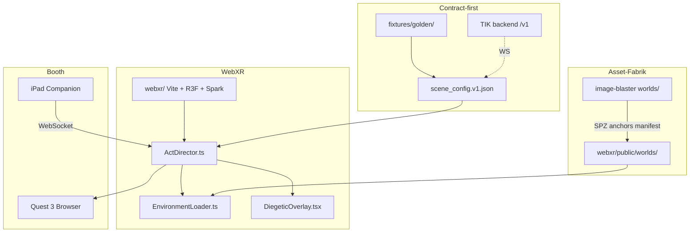

# Persona Reality — WebXR Runtime (Quest 3)

Stand: Mai 2026 · **Booth runtime:** `TIK/webxr/` + Quest Browser (kein native APK).

Verwandt: [image-blaster-setup.md](./image-blaster-setup.md) · [image-blaster-world-anchors-only.md](./image-blaster-world-anchors-only.md) · `fixtures/golden/klaus_dortmund_de.json`

---

## 1. Ziel

Act 2–4 (Küche, Office, Living) als **Gaussian-Splat-Welten** im Quest-3-Browser, gesteuert durch `scene_config.json` (AUDION oder Golden-Fixture + iPad WebSocket).

| In Scope | Out of Scope (v1) |
|----------|-------------------|
| Acts 2–4 + Void stubs | Vollständiger Avatar-Rig |
| SPZ/PLY + GLB-Props an Ankern | Store-APK |
| Overlays (`news_feed`, CHECKION) | Live echeon-Fetch am Stand |
| WebXR + Desktop-Fallback | — |

**Beispiel-Welt:** `schott-act2-kitchen` (image-blaster) · **Golden:** `klaus_dortmund_de.json`

---

## 2. Architektur



**Prinzip:** `scene_config.json` ist die API. Ein Client: **WebXR**.

---

## 3. Repo-Layout

```text
TIK/webxr/
  public/worlds/<slug>/     # sync aus image-blaster
  public/scene_configs/     # golden copies
  src/runtime/              # SceneConfigLoader, ActDirector, …
  scripts/sync-world-from-blaster.sh
```

```bash
cd TIK/webxr && npm install && npm run dev
WORLD_SLUG=schott-act2-kitchen SPLAT_TIER=150k ../webxr/scripts/sync-world-from-blaster.sh
```

Pfade: `knowledge/repos-and-urls.md`

---

## 4. Assets & Pipeline

```text
Referenzbild / Prompt
  → image-blaster (world + anchors)
  → worlds/<slug>/output/world/*.spz
  → worlds/<slug>/anchors.json  (Viewer /anchors)
  → webxr/scripts/sync-world-from-blaster.sh
  → webxr/public/worlds/<slug>/
```

| Asset | Format | Quelle |
|-------|--------|--------|
| Raum | `.spz` (150k/100k am Quest) | World Labs via image-blaster |
| Anker | `anchors.json` | image-blaster editor |
| Props | `.glb` | optional image-blaster meshes |
| Session | `scene_config.json` | AUDION / golden |

**Anker Act 2:** `phone_main`, `wall_calendar`, `kitchen_counter_docs`

---

## 5. Tech-Stack

| Schicht | Wahl |
|---------|------|
| Runtime | Vite + React |
| 3D | React Three Fiber + Spark (`@sparkjsdev/spark`) |
| XR | WebXR Device API |
| Config | Zod vs `scene_config.v1.schema.json` |
| Transport | `fetch` golden → später WebSocket (iPad) |

---

## 6. Quest-3-Checkliste

- [ ] Splat-Tier ≤ 150k für Booth
- [ ] Assets unter `public/worlds/` (offline test)
- [ ] WebXR startet &lt; 10 s
- [ ] Overlay bei `pickup` / `phone_main` lesbar
- [ ] 5 min ohne Tab-Crash
- [ ] FPS ≥ 72 sustained (Ziel Messe: 90)

Protokoll: `knowledge/webxr-pilot-results.md`

---

## 7. Implementiert

| Feature | Status |
|---------|--------|
| WebXR + Controller | ✅ |
| Acts 2–3 Welten | ✅ |
| CHECKION dashboard | ✅ |
| Scene props + Spark | ✅ |
| iPad WS stub | ✅ `npm run companion:mock` |
| Asset precache | ✅ |

---

## 8. URLs

| Ressource | URL |
|-----------|-----|
| Meta Immersive Web SDK | https://iwsdk.dev/ |
| World Labs GS export | https://docs.worldlabs.ai/marble/export/gaussian-splat |
| image-blaster | https://github.com/neilsonnn/image-blaster |
| JSON Schema | `TIK/scene_config.v1.schema.json` |

---

## 9. Nächste Schritte

1. `WORLD_SLUG=<slug> ./webxr/scripts/sync-world-from-blaster.sh`
2. Quest Browser → LAN-URL → VR testen
3. Anker in image-blaster `/<slug>/anchors` nachjustieren
4. FPS log → `webxr-pilot-results.md`
